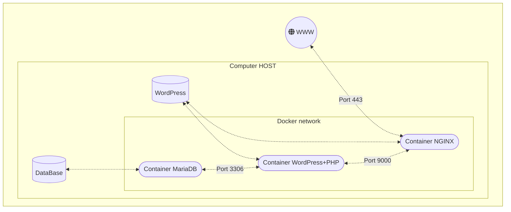

# INCEPTION

Этот проект направлен на расширение знаний о системном администрировании с помощью Docker. Я виртуализировал несколько образов Docker, создав их на своей виртуальной машине.

Я настроил:
* Контейнер Docker, содержащий nginx - сервер.
* Контейнер Docker, содержащий WordPress + php-fpm без nginx.
* Контейнер Docker, содержащий MariaDB без nginx.
* Том, содержащий базу данных MariaDB.
* Том, содержащий файлы WordPress.
* Docker-сеть, которая устанавливает соединение между контейнерами.

Контейнеры перезапускаются в случае сбоя.

